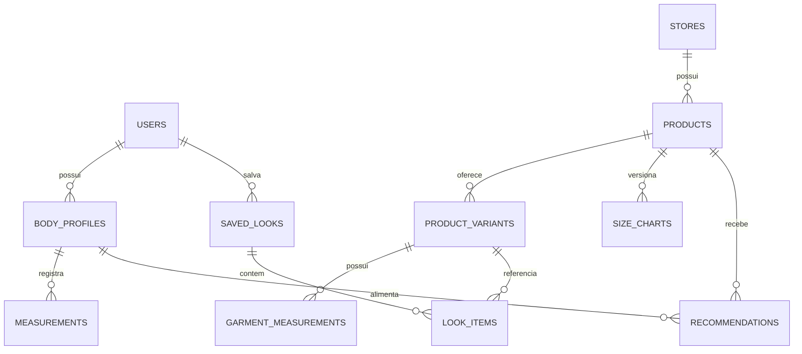

# Arquitetura

## O que faz e por que

Monólito modular sem dependências de build: HTML semântico, CSS responsivo e módulos JavaScript. Isso mantém o MVP executável com Node e facilita a apresentação. React/TypeScript não são pré-requisitos para demonstrar o produto e ficam como evolução; não alegamos que estejam implementados.

```
index.html + styles.css
  src/app.js (orquestração da sessão)
    features/body-profile       entrada e fotos locais
    features/body-analysis      câmera, worker, pose e revisão
    features/size-recommendation explicação do resultado
    features/virtual-tryon       geometria e PNGs por camada
    features/outfits            looks e carrinho em memória
    features/products           administração demonstrativa
    features/integration        loja e API
    features/offline            cache só de assets
  src/domain                    validação, catálogo, sessão e motor puro
  api/v1                        handlers HTTP para Vercel e servidor local
  scripts/build.mjs             copia assets e gera manifesto versionado
  scripts/dev-server.js         servidor local ou preview do build
```

API e navegador compartilham o mesmo motor. Catálogos personalizados enviados à API são entradas temporárias, nunca gravações. O catálogo público da API contém somente as quatro peças fictícias. O widget abre o produto padrão em uma nova aba; não sincroniza perfis entre lojas.

## Banco planejado (não ativo no MVP)



Medidas: valor, unidade, convenção (circunferência/largura plana/linear), origem (manual/estimada), intervalo de incerteza quando validado e revisão. Recomendações referenciam versões do perfil, tabela e motor. Store memberships autorizam usuários por loja. Virtual tryons guardam metadados opcionais, sem foto obrigatória.

SQLite pode iniciar persistência de catálogo; PostgreSQL será avaliado para múltiplas lojas. JSON e estado em memória bastam para o modo demo atual. Não existe promessa de dados persistidos.

## Limitações e evolução

Sem autenticação, pagamentos, multitenancy ou banco. Antes do SaaS: autorização por loja, contratos versionados, integração autenticada, feedback e provas de roupas. Frontend pode migrar para React/TypeScript mantendo o domínio e handlers.
